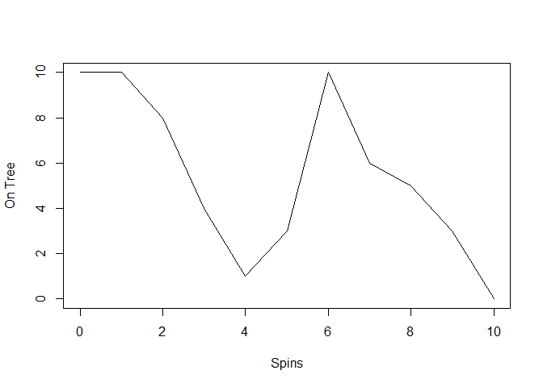

<!-- README.md is generated from README.Rmd. Please edit that file -->

# cherryr

<!-- badges: start -->

[](https://github.com/wilsondmw/cherryr/actions/workflows/R-CMD-check.yaml)
<!-- badges: end -->

The goal of cherryr is to simulate a game of Hi Ho Cherry-o. They will
call the `play_game` function with arguments of the number of cherries
to start with on the tree, and a max number of turns to allow the game
to play. `play_game` will return a cherry object which contains
information about the game including what happened on each turn.

## Installation

You can install the development version of cherryr from
[GitHub](https://github.com/) with:

``` r
# install.packages("devtools")
devtools::install_github("wilsondmw/cherryr")
```

## Example

In order to simulate a game of Hi ho cherry O the user will call the
‘play_game’ function and specify the number of cherries that will start
on the tree.

``` r
devtools::load_all()
#> i Loading cherryr
#> Warning: package 'testthat' was built under R version 4.1.3
library(cherryr)
my_game <- play_game(10)
```

The above will return an object of the cherry class. It will primarily
give the number of turns that it took to play a complete game, but the
object will also store the results of each turn until the game is over
which can be visulaised by calling the ‘plot’ function on a cherry
object which will show cherries being removed from and added to the tree
until the game is over.

``` r
plot(my_game)
```


